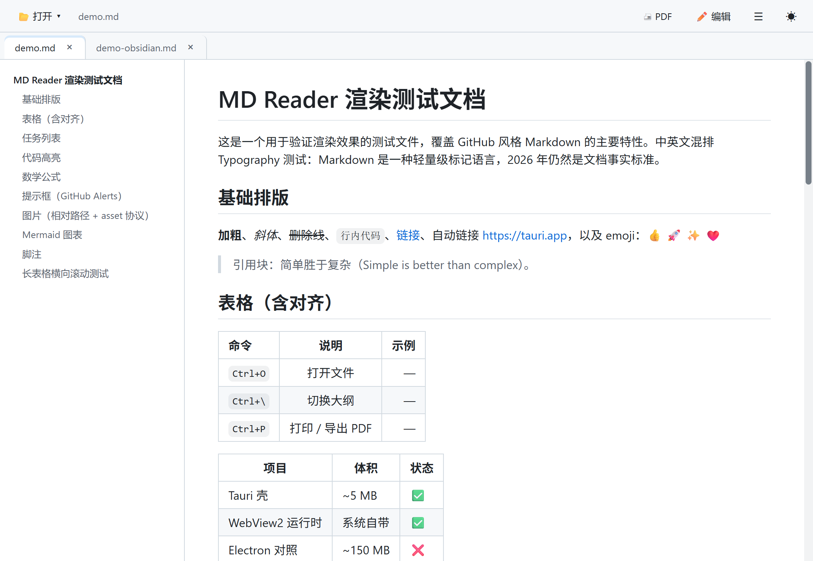
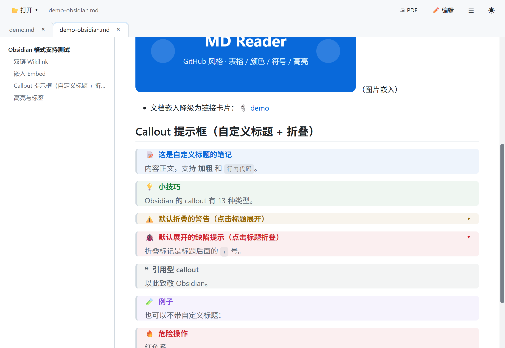
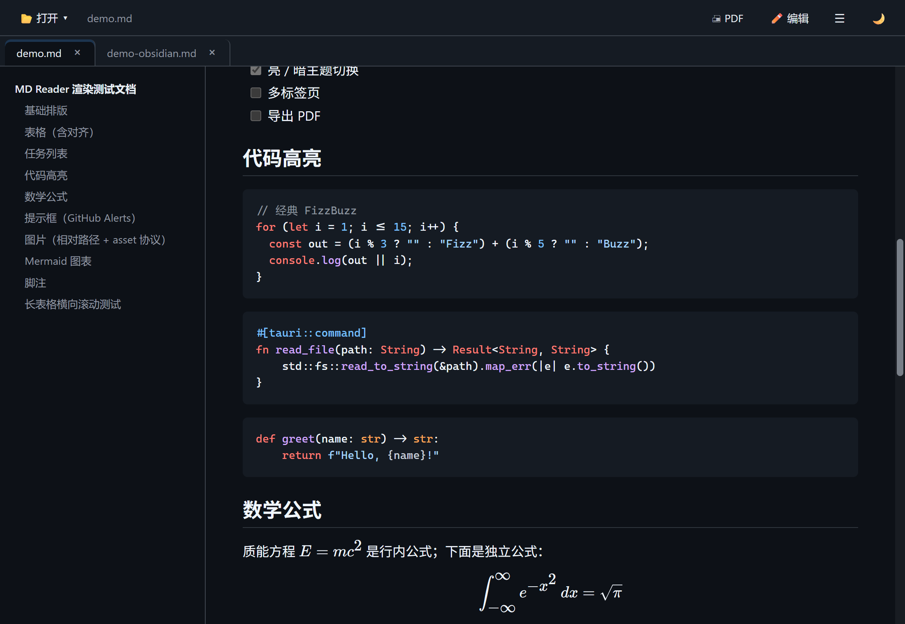
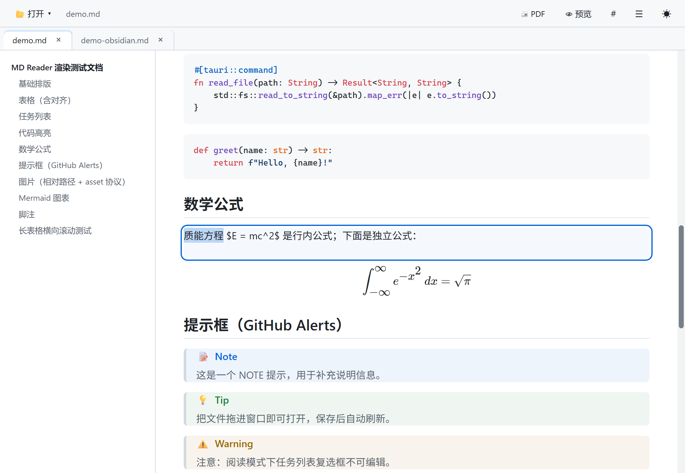

# MD Reader

[](LICENSE)

一个为"每天要读很多 Markdown 的人"做的 Windows 阅读器，以 [MIT 许可](LICENSE)开源。

研究报告、会议纪要、技术笔记、AI 产出的长文——如果你的硬盘里堆满了 .md 文件，MD Reader 让它们读起来像一本书，而不是一堆源代码。

## 界面预览









## 读：舒服地读

打开就能读。GitHub 风格排版，代码高亮、表格、数学公式、Mermaid 流程图、任务清单、Obsidian 风格的双链、提示框与高亮，常见写法都认；老文档的 GBK 编码也能自动识别。

长文档左侧自动生成大纲，一键跳到任意章节；需要对照源文件时，点一下工具栏的 `#`，正文左侧就会显示每个段落的源码行号；明暗两套主题跟随系统，晚上读不刺眼；需要留档时一键导出 PDF。

合上再打开，每个标签还停在你上次读到的位置。阅读进度按标签记忆，重启电脑也不丢。

## 理：像浏览器一样整理

多标签，多窗口。把一个标签往标签栏外一拖，它就变成一个独立窗口；拖回来自动合并，阅读进度跟着走。同一份资料可以开两个窗口对照着读，读完拖回去，空窗口自动收起。

文件在磁盘上被别的工具改动时，你正读着的这份会自动刷新；而你正在编辑的内容不会被外部改动打断。

## 改：想改哪段点哪段

双击任意段落、标题、列表或表格，就地进入编辑——文字大小和样式保持原样（标题依旧是大号粗体，只是多了灰色的 `##` 标记），光标就停在双击的位置，双击选中的词保持选中；改完 Ctrl+Enter 或点空白处，立刻变回排版好的样子。不用切换"编辑模式 / 预览模式"，不用盯着源代码，读到哪、改到哪。

关闭有未保存修改的文档时会逐项询问，保存失败绝不退出，内容不会悄悄丢失。

## 放心：一切都在你电脑上

- 单个 6.6 MB 的 exe：免安装、免管理员权限、不写注册表，拷到 U 盘就能用。
- 无账号、无云端、不上传：文档内容不出你的电脑。渲染全程经过严格沙箱，文档里藏了什么内容也伤不到系统。
- 支持 .md / .markdown / .mdown / .mkd / .txt，单个文件最大 50 MB。

## 快速上手

1. 把 `mdreader.exe` 放到任意目录，双击运行；
2. 从"打开"菜单选择文件，或直接把文件拖进窗口；
3. 想让双击 .md 文件就用它打开：右键文件 → 打开方式 → 选择 MD Reader（`tools/` 目录里另备了一键关联与撤销关联的注册表脚本）。

环境要求：Windows 10 / 11（依赖 WebView2 运行时，绝大多数系统自带；缺失时[从这里安装](https://developer.microsoft.com/microsoft-edge/webview2/)一次即可）。安装包未签名，首次运行如遇 SmartScreen 拦截，点「更多信息 → 仍要运行」。

## 快捷键

| 键 | 功能 |
|----|------|
| `Ctrl+O` | 打开文件 |
| `Ctrl+E` | 进入 / 退出编辑模式（点哪段改哪段） |
| `Ctrl+S` | 保存（编辑模式） |
| `Ctrl+\` | 显示/隐藏大纲 |
| `Ctrl+P` | 导出 PDF / 打印 |

---

# 开发与部署（面向维护者）

## 功能细节

- **渲染**：表格（列对齐/横向滚动）、任务列表、~~删除线~~、自动链接、Emoji、脚注；highlight.js 代码高亮（40+ 语言，亮/暗双主题）；KaTeX 数学公式（`$...$` / `$$...$$`）；Mermaid 图表（懒加载渲染）
- **GitHub Alerts**：`> [!NOTE]` / TIP / IMPORTANT / WARNING / CAUTION 五色提示框
- **Obsidian 双链**：`[[页面]]`、`[[页面|别名]]`、`[[页面#标题]]`（跳转后滚动定位）；`![[嵌入]]` 支持图片/音频/视频与 `|200`、`|100x200` 尺寸语法（md 嵌入降级为链接卡片）。链接与图片目标先按相对路径解析，找不到再在当前目录及子目录（≤3 层）按文件名递归查找；仍找不到显示灰色缺失占位。支持中文与空格文件名
- **Obsidian Callout**：`> [!note] 自定义标题`，16 种类型，支持 `-`（默认折叠）/`+`（默认展开），点击标题切换
- **Obsidian 行内语法**：`==高亮==`、`#标签`（药丸样式）、`%%注释%%`（渲染时隐藏）
- **实时编辑（Obsidian Live Preview 同款内核 CodeMirror 6）**：双击块就地编辑，排版继承所在块（标题保持大号粗体），加粗/斜体/行内代码/链接按渲染样式呈现；光标所在行显示源码标记（`##`、`**` 淡化），其余行自动隐藏标记——所见接近最终排版；双击光标/选区经"渲染字符 ↔ 源码字符"映射落在原地；`Ctrl+Enter` 提交、`Esc` 放弃、清空即删除该块（块内支持 `Ctrl+Z` 撤销）。块与源码的映射靠渲染期 `data-line` 行号锚（VS Code 预览同款机制），浏览器对原始 HTML 的重排嵌套不会破坏定位；含原始 HTML 的折叠块（`<details>` 等）支持整段编辑
- **行号栏**：工具栏 `#` 开关（偏好记忆），每个顶层块左侧显示源码起始行号——复用 `data-line` 同源锚（渲染期附 `data-line-no`，fence 的锚搬运到外层 `<pre>`），`<details>` 内的嵌套块同样有行号；打印 / PDF 不输出
- **保存**：原子写入（临时文件+替换，白名单扩展名）；切换文档时自动保存；编辑期间外部修改不覆盖未保存的编辑
- **编码**：UTF-8（含 BOM）/ UTF-16 / GBK 自动识别回退，保存统一写 UTF-8（无 BOM）
- **打开失败有提示**：文件超限、编码损坏或被锁定时弹窗说明原因

## 安全设计

- **CSP（仅打包版生效）**：`default-src 'none'`，脚本仅限自身、图片限 https 与 asset 协议——不可信文档无法向任意服务器外发请求。注意：`tauri dev` 模式 CSP 不注入，安全测试须用 release 版
- **文件读取面收紧**：Rust 侧只接受 `.md/.markdown/.mdown/.mkd/.txt` 且 ≤ 50 MB；图片路径仅在媒体扩展名时转换为 asset 协议 URL
- **渲染消毒**：DOMPurify 清洗所有渲染 HTML 与 mermaid SVG（允许内联 `style`）
- **依赖审计**：`npm audit` 0 漏洞（mermaid 固定 11.x）

## 开源组件与授权

本程序使用以下开源组件（均为允许商用与再分发的宽松许可）：

| 组件 | 用途 | 许可 |
|------|------|------|
| Tauri（含插件） | 应用框架 | MIT / Apache-2.0 |
| markdown-it 及插件（anchor / emoji / footnote / task-lists / katex） | Markdown 渲染 | MIT / Unlicense / ISC |
| DOMPurify | HTML 消毒 | Apache-2.0 / MPL-2.0 |
| highlight.js | 代码高亮 | BSD-3-Clause |
| Mermaid | 图表 | MIT |
| KaTeX | 数学公式（软件） | MIT |
| KaTeX 字体 | 数学字形（随包分发） | SIL OFL 1.1（免费商用，全文见 `licenses/KaTeX-fonts-OFL-1.1.txt`） |
| CodeMirror 6（@codemirror/*、@lezer/*） | 块就地编辑器（Obsidian 同款内核，懒加载） | MIT |
| github-markdown-css | 排版样式 | MIT |
| Rust 侧依赖（serde、notify、encoding_rs 等） | 序列化 / 文件监听 / 编码 | MIT / Apache-2.0 / CC0 类 |

界面字体（Segoe UI、微软雅黑、Consolas、Cascadia Code 等）均为**按名称引用**、由用户操作系统解析，程序不附带、不分发这些字体文件；其中 Cascadia Code 本身也是微软以 SIL OFL 发布的开源字体。

## 开发

```bash
npm install        # 安装前端依赖
npm run tauri dev  # 开发模式（改前端即时热更新）
```

首次 `cargo` 编译较慢（几分钟），之后增量编译很快。

## 打包安装（双击 .md 打开的前提）

```bash
npm run tauri build
```

产物在 `src-tauri/target/release/bundle/`：

- `nsis/mdreader_0.2.0_x64-setup.exe` —— 推荐安装（含 `.md` 文件关联）
- `msi/mdreader_0.2.0_x64_en-US.msi` —— MSI 安装包
- `../mdreader.exe` —— 单文件绿色版

## 绿色版部署

1. 把 `src-tauri/target/release/mdreader.exe` 复制到固定目录，**之后不要移动路径**——文件关联指向该路径
2. 双击导入 `tools/portable-associate.reg`（写 HKCU 级 `.md`/`.markdown` 关联）
3. 导入后重启资源管理器或注销重登一次，让 shell 刷新关联缓存
4. 想撤销：导入 `tools/portable-unassociate.reg`，`.md` 自动回落到原有关联
5. 程序更新：重新构建后覆盖 exe 即可，关联不受影响

注意：

- **直接用 cargo 构建绿色版必须带 feature**：`cargo build --release --features custom-protocol`。缺了它产出的是连 `localhost:1420` 的开发版二进制（页面显示"无法访问此页面"）；`npm run tauri build` 不受影响
- 从 Git Bash 静默安装要绕开 MSYS 参数转换：`cmd //c start "" "setup.exe" /S`
- 安装后若 `.md` 默认打开方式没变，在任意 .md 上右键 → 打开方式 → 选择 MD Reader → 始终
- 再次启动的实例（如双击第二个文件）会把路径转发给已运行的窗口，不会重复开进程

## 项目结构

```
├── index.html            # 应用外壳（工具栏/大纲/内容区）
├── ghost.html            # 标签拖拽时的跟手 ghost 小窗
├── src/
│   ├── main.js           # 渲染管线 + Obsidian 扩展 + 主题 + 大纲 + 事件
│   └── styles.css        # 应用 chrome / callout / 打印样式
├── src-tauri/
│   ├── src/lib.rs        # Rust：读文件(GBK回退)/监听/路径解析/双链查找/单实例/标签拖拽
│   ├── tauri.conf.json   # 窗口、asset 协议、打包、文件关联
│   └── capabilities/     # 权限声明
├── samples/
│   ├── demo.md           # GitHub 风格渲染测试文档
│   └── demo-obsidian.md  # Obsidian 语法测试文档（双链/callout/高亮/标签）
├── docs/images/          # README 界面截图
├── licenses/             # 随包分发资源的授权文本（KaTeX 字体 OFL 1.1）
├── tools/                # 绿色版 .md 文件关联/撤销关联注册表脚本
└── research.md           # 技术调研（选型依据）
```
